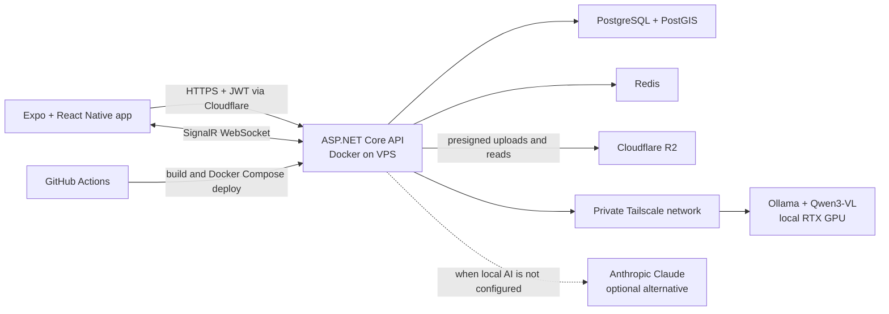

# UCompass technical reference

This document covers the system architecture, technology choices, local AI connection, deployment,
development environment, and HTTP API. See the [project README](../README.md) for the product overview
and quickest path to running the app.

## Architecture



The production API runs on a VPS behind Cloudflare. PostgreSQL and Redis use persistent Docker
volumes. Listing and avatar images go directly between the mobile client and R2 through presigned
URLs, keeping large uploads away from the API process.

## Technology stack

| Layer | Technology | Role |
|---|---|---|
| Mobile | Expo 57, React Native 0.86, React 19, TypeScript | Cross-platform application |
| Navigation and UI | Expo Router, React Native Maps, Reanimated, Gesture Handler | Typed routes, maps, sheets and interactions |
| Mobile security | Expo SecureStore | Stores the JWT session on device |
| API | ASP.NET Core 10, C# | REST API, authentication, validation and business rules |
| Data | PostgreSQL 17, PostGIS, EF Core 10 | Relational and geospatial data |
| Realtime and cache | SignalR, Redis 7 | Chat, typing, read state, meetup updates and verification codes |
| Object storage | Cloudflare R2 through its S3-compatible API | Avatars and listing photos |
| Local AI | Ollama, `qwen3-vl:8b-instruct` | Vision analysis and structured listing suggestions |
| Private AI networking | Tailscale | Connects the VPS API to the local inference machine without exposing Ollama publicly |
| Optional hosted AI | Anthropic Claude | Alternative vision provider when local Ollama is not configured |
| Local development | Docker Compose, Mailpit, Swagger/OpenAPI | Reproducible services, captured email and API exploration |
| Delivery | GitHub Actions, self-hosted runner, Docker Compose | Builds, deploys and checks the production API |

## Local AI over Tailscale

UCompass uses a local-first vision pipeline. The current demo runs `qwen3-vl:8b-instruct` with Ollama
on an RTX-equipped development machine. The production API reaches that machine through its private
Tailscale address, so port `11434` does not need to be exposed to the public internet.

The AI features are:

| Feature | Model output | How UCompass uses it |
|---|---|---|
| Sell from a photo | Title, category, condition, colours, texture, suggested price, description and benefits | Pre-fills an editable marketplace draft |
| List a room from a photo | Title, style, colours, furnishing, visible features, description and benefits | Pre-fills an editable flat listing draft |
| Search the market by photo | Category, a short label and keywords | Filters unsold items and ranks matching listing text |

The mobile app resizes the photo to a 640 px JPEG and sends it as base64 to the API. The API calls
Ollama's `/api/chat` endpoint with a JSON schema, disables thinking output, validates the response and
returns typed fields to the app. The analysis image is not stored. A user still reviews every suggested
field before publishing.

Set these values in `.env` to use the local model:

```dotenv
OLLAMA_BASE_URL=http://<tailscale-ip>:11434
OLLAMA_MODEL=qwen3-vl:8b-instruct
```

Both the VPS and inference machine must be connected to the same Tailscale network, and Ollama must
listen on an interface reachable through that network. If `OLLAMA_BASE_URL` is empty, the API uses
Claude when `ANTHROPIC_API_KEY` is configured. This selection happens from configuration; an unreachable
local model returns an unavailable response instead of silently sending the photo to Claude.

## Repository layout

```text
backend/src/UniMap.Api/
  Controllers/   HTTP endpoints for auth, profiles, flats, market, meetups, chat, card draws and AI
  Contracts/     Request and response models
  Data/          EF Core context, migrations and demo seed data
  Domain/        Entities and shared catalogs
  Hubs/          SignalR realtime hub
  Services/      JWT, Redis, R2, email, chat mapping and vision AI

mobile/
  src/app/       Expo Router routes
  src/features/  Product screens and feature logic
  src/api/       API client, uploads and realtime connection
  src/store/     Application state
  src/theme/     Colours, type and shared styles

.github/workflows/   CI/CD workflows
docker-compose.yml   Local backend stack
docker-compose.prod.yml  VPS stack
```

## Mobile quick start

```bash
cd mobile
npm install --legacy-peer-deps
npx expo start
```

Scan the QR code with Expo Go. To use a locally running API from a physical phone, start Expo with
`EXPO_PUBLIC_API_URL=http://<your-computer-lan-ip>:8080`; the phone cannot reach the computer through
`localhost`.

## Hosted API (for the mobile app)

Base URL: **https://hackathon-2026-map.bookmountain.work**, with Swagger at
[/swagger](https://hackathon-2026-map.bookmountain.work/swagger).

- It has the same demo data as local dev. Log in as Koala_Kai (`a1900000@adelaide.edu.au`,
  `password123`) or any student in `students.json`.
- There's no real email yet, so `POST /api/auth/register` returns the verification code as `devCode`. Pass
  it straight to `/api/auth/verify`.
- Send `Authorization: Bearer {accessToken}` on every call. For chat and live meetup headcounts, connect
  SignalR to `wss://hackathon-2026-map.bookmountain.work/hubs/chat?access_token={jwt}`.
- Images come back as full URLs that last 24 hours, so load them as they are.

Every push to `main` or `deploy` that touches `backend/` redeploys it
(`.github/workflows/deploy-api.yml`). The workflow builds on GitHub, then a self-hosted runner on the
server runs `docker-compose.prod.yml`. Secrets are in `/work/hackathon-2026/.env` on the server, not in git.

## Backend quick start

Requires Docker (with Compose v2). No local .NET SDK needed.

```bash
cp .env.example .env        # optional, defaults work
docker compose up --build   # first run restores NuGet packages, ~1 min
```

| What        | Where                                                       |
|-------------|-------------------------------------------------------------|
| Swagger UI  | http://localhost:8080/swagger                               |
| Health      | http://localhost:8080/health                                |
| Postgres    | `localhost:5432`, db/user/password `unimap` (use DBeaver)   |
| Redis       | `localhost:6379`                                            |
| Mailpit     | http://localhost:8025 (catches all outgoing email in dev)   |

Code in `backend/` is bind-mounted, and `dotnet watch` hot-reloads on save. It restarts
automatically when an edit can't be hot-applied.

Differences between the UCompass prototype and this API, for the app to handle, are listed in
[FRONTEND-GAPS.md](../FRONTEND-GAPS.md).

### Auth flow

1. `POST /api/auth/register` `{ email, password }`: the email must be `@adelaide.edu.au`,
   `@flinders.edu.au`, or a subdomain of either. In Development the response includes `devCode`,
   and the code is also printed in the `api` logs.
2. `POST /api/auth/verify` `{ email, code }` returns `accessToken`, `consentComplete` and
   `onboardingComplete`. These tell the app which screen comes next.
3. In Swagger, click **Authorize** and paste the token.
4. **Consent first.** `GET /api/consents` returns the 4 consents and their wording. `PUT /api/consents`
   with `{ terms, location, ageAndEnrolment, usageStats }`; the first three are required. Until they're
   granted, everything except `/api/me`, `/api/consents` and the auth endpoints returns
   `403 { code: "consent_required" }`. Every answer is kept with a timestamp, and withdrawing a required
   consent locks the app again.
5. Pick a degree with the three dropdown endpoints: `GET /api/degrees/levels` → `/api/degrees/colleges`
   → `/api/degrees`. There's also a `search` parameter for a type-ahead box.
6. `PUT /api/me/profile` with the onboarding answers, including `degreeId`. The department is filled in
   from the degree. `GET /api/meta/options` lists the suggested tags. It replaces the whole profile, so
   send back what didn't change, including `avatarKey` from `GET /api/me`: a missing key removes the
   photo. `avatarPreset` (0–7, or null) is the design's preset colour avatar; everyone sees it wherever
   they'd see the photo, and the photo wins when there's both. `avatarStyle` holds the rest of the avatar
   builder: `mode` (`Initials` or `Icon`), `text` (1–2 letters, or "" for the nickname's first letter),
   `icon` (`Compass`, `Book`, `Coffee`, `Music`, `Code`, `Leaf`, `Camera`, `Ball`, `Paw`, `Rocket`), `shape`
   (`Circle`, `Soft`, `Square`) and `ring` (`None`, `Gold`, `Blue`, `Navy`, `Sky`). It comes back everywhere
   `avatarPreset` does. "Anonymous" is `avatarPreset: null`.
7. `DELETE /api/me` deletes the account and everything in it: profile, consents, rooms, items, hosted
   events, RSVPs, chats (for both people), drawn cards and the account's photos in R2. It works before
   consent. Students who drew them keep their card, with `match: null`.
   People going to a deleted event get `eventCancelled`.

### Flats (flatmate finder)

All of these need a login token, except `options`.

- `GET /api/flats/options`: chip options for the "List a room" form, plus campus locations for the map.
- `GET /api/flats`: search, for both the map and the list view. Filters are `search` (the search box:
  title, suburb or street), `maxRent`, `maxBills`,
  `furnished`, `toilet`, `features`, a map viewport (`minLat`…`maxLng`), and
  `campus` + `maxWalkMinutes`. `sort` is `newest`, `cheapest` or `nearest`.
- `GET /api/flats/{id}`: room detail, with walk times to every campus and the owner's nickname, major
  and avatar.
- `POST /api/uploads/flat-photo`, then `POST /api/flats`: upload up to 5 photos, then list the room.
  Photos are stored one R2 folder per listing, `flats/{listingId}/`. The first upload returns a new
  `listingId`. Send it with the remaining photos, and as `id` when creating the listing.
- `PUT /api/flats/{id}`, `PUT /api/flats/{id}/status` (`Active` or `Taken`), `DELETE /api/flats/{id}`,
  `GET /api/flats/mine`.
- `POST /api/ai/photo-analysis` with `kind: "Room"` fills in "List a room" from a photo (see Photo analysis
  below).

Other students see each pin rounded to about 100 m; only the owner sees the exact spot.

### Market (second-hand items)

All of these need a login token, except `options`.

- `GET /api/items/options`: categories and conditions (value + label to show), the three safe pickup
  points, and the photo limit.
- `GET /api/items`: search, for both the map and the grid. Filters are `category` (the chips; leave it
  out for "All"), `search` (title or description), `pickupPoint`, `maxPrice` and a map viewport
  (`minLat`…`maxLng`). `sort` is `newest` or `cheapest`. Sold items are left out unless `includeSold=true`:
  the prototype's grid shows them greyed out, its map doesn't.
- `GET /api/items/pickup-points`: the ★ pins, with how many items are waiting at each (pass `category`
  to match the selected chip). Tapping one lists its items: `GET /api/items?pickupPoint={id}`.
- `GET /api/items/{id}`: item detail, with the seller's nickname, major, uni and avatar. `isMine` means
  show "Your listing"; availability `Sold` means show a disabled "Sold" button.
- `POST /api/uploads/item-photo`, then `POST /api/items`: upload 1 to 5 photos, then post the item.
  Photos are stored one R2 folder per item, `items/{itemId}/`. The first upload returns a new `itemId`.
  Send it with the remaining photos, and as `id` when creating the item. A photo is required, and the
  server checks it was actually uploaded.
- `PUT /api/items/{id}`, `PUT /api/items/{id}/availability` (`Now`, `From` + `availableFrom`, `Pending`
  or `Sold`), `DELETE /api/items/{id}`, `GET /api/items/mine`.
- Pickup is either a safe pickup point (`pickupPointId`) or the seller's own pin (`lat`, `lng` and an
  optional `placeName`). Other students see a seller's own pin rounded to about 100 m; pickup points
  are exact.
- Condition is `New`, `LikeNew`, `Excellent`, `Good` or `Fair`, plus an optional note. `conditionLabel`
  is ready to show, e.g. "Good — some highlighting".
- "Message seller" is `POST /api/chats` with `{ itemId, text }` (see below).
- `POST /api/ai/photo-analysis` with `kind: "Item"` fills in the Sell form from a photo, and
  `POST /api/items/image-search` is the camera button in the search box (see Photo analysis below).

### Meetups (walk-in events)

All of these need a login token, except `options`. **Hosts and guests are anonymous:** no endpoint says
who hosts an event or who's going, only the headcount (`goingCount`) and whether *you* are hosting
(`isHost`) or going (`isGoing`).

- `GET /api/events/options`: the four types (`Study`, `Casual`, `Social`, `Food`), the preset places (the
  three safe pickup points) and the capacity slider's range (4 to 60, default 20).
- `GET /api/events`: upcoming events, soonest first, for both the map and the list. Filters are `type`,
  `search` (the search box: title or place name) and a map viewport (`minLat`…`maxLng`). Events that have ended are left out: after `endsAt`, or 2 hours after
  the start when there's no end time. Events happening now are included (`isHappeningNow`).
- `GET /api/events/{id}`: event detail. Show the host as "Hosted anonymously · Verified student host".
- `POST /api/events` ("Publish event"): `title`, `type`, `startsAt` (with a UTC offset, e.g.
  `2026-09-29T19:00:00+09:30`; convert the datetime-local input first), optional `endsAt`, `description`,
  `capacity` and `walkInsWelcome` (default true). The place is either `placeId` (a preset, with an optional
  `placeName` like "Barr Smith Library, Level 2") or `lat`/`lng` with `placeName` ("Name this spot",
  default "Pinned location"). The host is counted as going.
- `POST /api/events/{id}/join` and `DELETE /api/events/{id}/join`: the Join / "Going ✓" toggle. Both return
  the updated card and do nothing if you're already in (or out). Joining a full or finished event returns 409.
  The prototype's toast is "You're in. Just walk in — no one sees your name."
- `GET /api/events/mine` (events you host, past ones too), `GET /api/events/going` (upcoming events
  you've joined), `PUT /api/events/{id}` and `DELETE /api/events/{id}` (host only; capacity can't go below
  the number already going).
- Labels are ready to show, in Adelaide time: `dayLabel` "TUE", `dateLabel` "29", `timeLabel` "7:00 pm" for
  the list card, and `whenLabel` "Tue 29 Sep · 7:00–9:30 pm" for the detail page.
- Event places are exact, so people can find them. Nothing links a place to its host.
- Real time on `/hubs/chat`: `eventGoing` (`{eventId, goingCount}`) goes to everyone when someone joins or
  leaves; `eventUpdated` (`{eventId}`) and `eventCancelled` (`{eventId, title}`) go to the people going.
- There's no "Message host" button, since the host is anonymous.

### Chats (messaging)

One chat per pair of students. Other people only see your nickname, major, uni and avatar.

- `POST /api/chats` with `{ flatId, text }`: the "Message tenant" button. Opens or reuses the chat with
  the listing's owner and adds an "About: {listing} · $rent/wk" line.
- `POST /api/chats` with `{ itemId, text }`: the "Message seller" button. Adds an "About: {title} · $price"
  line. The prototype pre-fills the text as "Hi! Is the {title} still available?". Sold items return 409.
- Use `{ userId, text }` to message a student directly.
- `POST /api/chats` with `{ drawId, text }`: "Send a message to {nick}" from a card draw. Adds a
  "Daily card match · 27 Sep" line (`about.type` `DailyCard`, nothing to open). The prototype pre-fills
  "Hey! We drew each other today".
- `GET /api/chats`: your chats, with the last message and unread count.
- `GET /api/chats/{id}/messages` (page back with `before`), `POST /api/chats/{id}/messages`,
  `POST /api/chats/{id}/read`.
- Real time: connect SignalR to `/hubs/chat?access_token={jwt}`. The server sends `message`, `read` and
  `typing` events (and the meetup events above). Call the hub method `Typing(conversationId)` to show "•••" to the other person.

About lines have `about.type` `Flat`, `Item` or `DailyCard`.

Koala_Kai (`a1900000@adelaide.edu.au`) has 3 seeded chats, 2 with unread replies. One of them is the
prototype's: TomTheTutor messaging about his Calculus textbook.

### Daily card draw

Draw one card a day to meet a random fellow student. All of these need a login token.

- `GET /api/daily-card`: `status` is `Ready` ("Draw your card"), `Matched` ("Your card today") or `Missed`
  ("Deck locked"). Also `drawnToday` ("143 students have drawn today") and `nextChangeAt`, the next Adelaide
  midnight, for all three clocks ("Deck resets in", "Next draw in", "Unlocks in"). With `Matched`: `match`
  (nickname, major, uni and avatar, like a chat), `drawId`, and `details` for the rest of the card:
  `pronouns`, `yearOfStudy`, `bio`, `interests` and `sharedInterests` (the ones you have too). Only your
  daily match sees these.
- `POST /api/daily-card/draw`: the Draw button. It returns the same thing, and does nothing if you've already drawn
  today. 409 if nobody is left to draw.
- `POST /api/daily-card/reset` (demo servers only): starts your card over so you can draw again, for running
  the demo twice. `?missedDay=true` also pretends you skipped yesterday. Turned on by `DAILY_CARD_DEMO_RESET`
  (`DailyCard__DemoReset`), which the hosted demo sets; otherwise it's a 404. `GET` says `canReset: true` when
  it's on, and the app then shows its "Reset today" and "Simulate missed day" buttons.
- **Draws are mutual.** Drawing deals you a random student who hasn't drawn yet today, and deals you to
  them: when they press Draw they get you. Anyone with a profile and the required consents can be drawn,
  except students who missed a day. You don't get the same student two days running unless nobody else is
  left.
- **Missing a day.** If you didn't press Draw yesterday, `GET` says `Ready` with `missedDay: true`. Pressing
  Draw then deals nothing: it starts a new session and returns `Missed` until midnight, and from midnight you
  can draw again. For example, you skipped yesterday and it's 10 pm: Draw shows a 2-hour countdown. A new
  account can draw straight away.
- "Send a message to {nick}" is `POST /api/chats { drawId, text }` (see Chats).

### AI photo analysis and visual search

The server asks a vision model what a photo shows: a local model on Ollama when `OLLAMA_BASE_URL` is set
(`qwen3-vl:8b-instruct` by default, configurable with `OLLAMA_MODEL`), otherwise Claude
(`claude-opus-5`, `Anthropic:Model`) when `ANTHROPIC_API_KEY` is set. Send the photo in the JSON body as
`image`: a base64 JPEG, PNG, GIF or WebP up to 3.75 MB. The app sends a JPEG with its longest side at
640 px. The analysis photo is sent only to the configured model and is not stored; listing photos are
uploaded separately to R2. With neither provider configured, these endpoints return 503 with
`code: "ai_not_configured"`. A busy, down or unreachable provider returns 503 or 502, and a photo the
provider refuses to describe returns 422.

- `POST /api/ai/photo-analysis { kind, image }`:
  - `kind: "Item"` pre-fills Sell with `title`, `category`, `condition`, `colour`, `texture`,
    `suggestedPrice` ("Use suggested price"), `description` and 3 `benefits`.
  - `kind: "Room"` pre-fills "List a room" with `title`, `style`, `colours`, `furnished`, `features` (only
    values from `/api/flats/options`), `description` and 3 `benefits`.
- `POST /api/items/image-search?limit=5 { image }`: `category` (null if none fits) and `items`, unsold items
  in that category, those whose title or description has the most keywords first. Also `label` ("Looks like:
  Desk lamp") and the `keywords` it matched on.

### Demo data

In Development, an empty database is seeded from `backend/src/UniMap.Api/Data/Seed/`:
- `students.json`: 48 fictional students with real degrees, including the 8 characters from the
  UCompass prototype, e.g. Koala_Kai = `a1900000@adelaide.edu.au`, hana_k = `hkim0044@flinders.edu.au`.
  The password is `password123` for everyone.
- `flats.json`: 40 room listings on Adelaide streets near each campus. Pins are offset so they do
  not point at a specific house.
- `items.json`: 60 market items, at campus pickup points or on local streets. "Available from"
  dates and posted times are relative to when the database is seeded.
- `events.json`: 16 walk-in meetups, the prototype's 4 plus 12 more at real places in the city and at
  Bedford Park and Mawson Lakes. Each is set on a weekday and time (Adelaide), always within the coming
  week: once one finishes, it moves to next week with its seeded headcount (checked on startup and
  hourly). Koala_Kai hosts one and is going to another.
- Images are already in R2, in the same layout as real data. Every folder is named after a database id:
  - `avatars/{userId}/avatar.png`: CC0 avatars
  - `flats/{listingId}/01-bedroom.jpg` and so on: real room photos from Gumtree, Wikimedia Commons
    and the original openly licensed collection. Gumtree photo reuse rights have not been verified.
  - `items/{itemId}/01.jpg` and so on: three real item photos per listing from eBay or Gumtree.
    Reuse rights for these photos have not been verified.

  Seeded students, listings and items have fixed ids (in `students.json`, `flats.json` and
  `items.json`), so a row's id in DBeaver is its R2 folder name. Credits are in `avatars.json`,
  `flat-photos.json` and `item-photos.json`. Seeded meetups have fixed ids too (`events.json`), but no
  images.

Run `docker compose up -d --build api` to add missing seeded listings to an existing development
database. A fresh database also receives all 100 listings on startup.

Allowed email domains are in `appsettings.json` → `Universities:Domains`.

The degree lists (Adelaide University and Flinders, researched from their websites) load into the
`degrees` table on startup, from `backend/src/UniMap.Api/Data/Seed/*.csv`. Known data issues are in
[TODO.md](../TODO.md).

### Database migrations (EF Core)

Migrations are applied automatically on startup. After changing entities in `Domain/`:

```bash
docker compose exec api dotnet ef migrations add <Name> --project src/UniMap.Api -o Data/Migrations
```

To start again from an empty database, run `docker compose down -v`.

### Email

By default, verification emails go to the local Mailpit container, where you can read them at
http://localhost:8025. To send real email, set `SMTP_*` in `.env`. `.env.example` has settings for
Resend and Gmail.

### Images (Cloudflare R2)

Put your R2 API token keys in `.env` as `R2_ACCESS_KEY_ID` and `R2_SECRET_ACCESS_KEY`. The account
ID and bucket are already filled in. The client calls `POST /api/uploads/avatar` to get a presigned
URL, sends the image to that URL with `PUT`, then saves the returned `key` as `avatarKey` on the
profile. If the bucket isn't public, avatar URLs are presigned GET links that last 24 hours.

### AI model configuration

The AI endpoints are optional; the rest of UCompass works without a model.

- **Local Ollama:** set `OLLAMA_BASE_URL` to the inference machine's Tailscale URL and optionally set
  `OLLAMA_MODEL`. The configured machine must be awake, running Ollama and reachable from the API.
- **Claude:** set `ANTHROPIC_API_KEY`. Claude is selected only when `OLLAMA_BASE_URL` is empty; it is not
  an automatic runtime failover for an unavailable local model.
